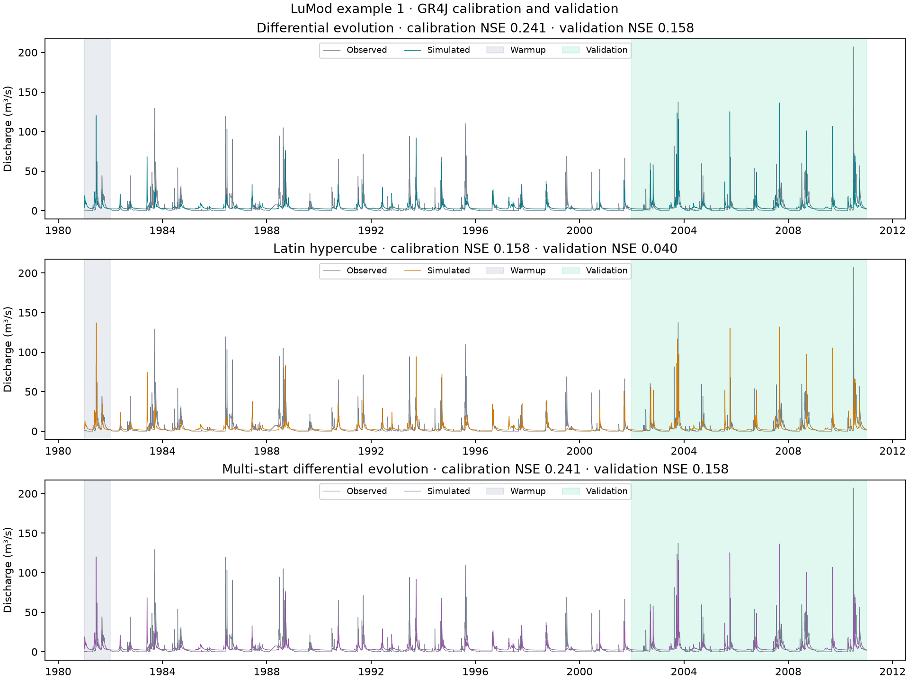
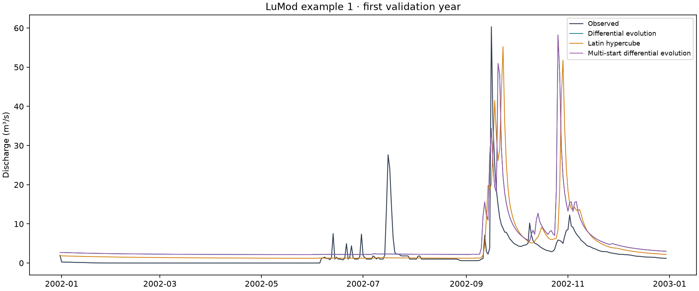
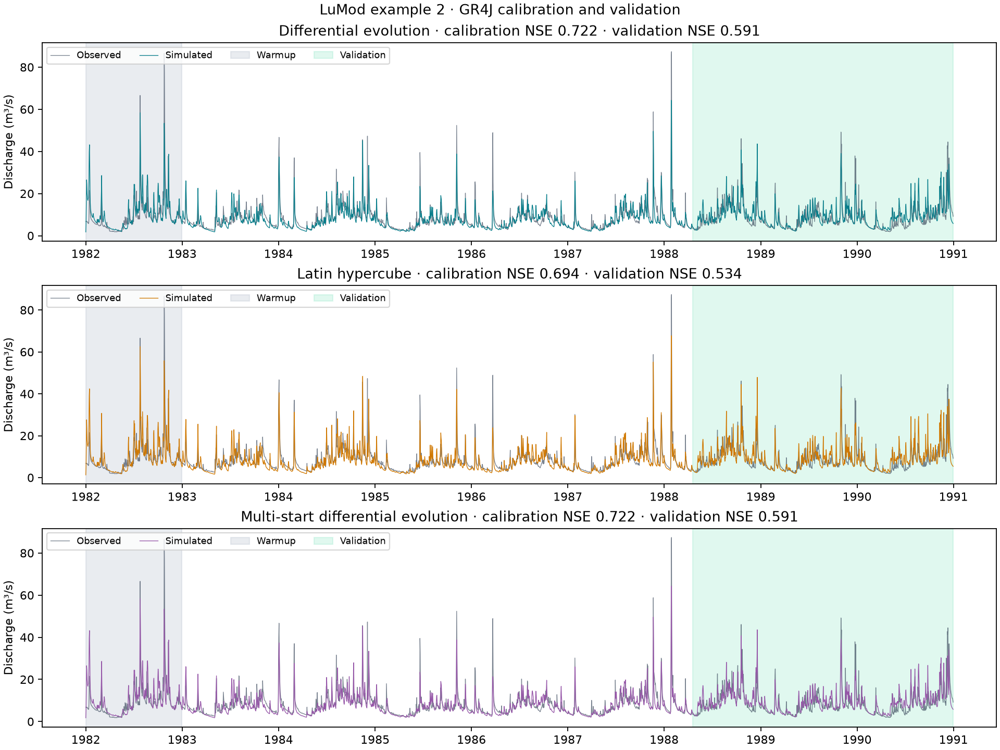
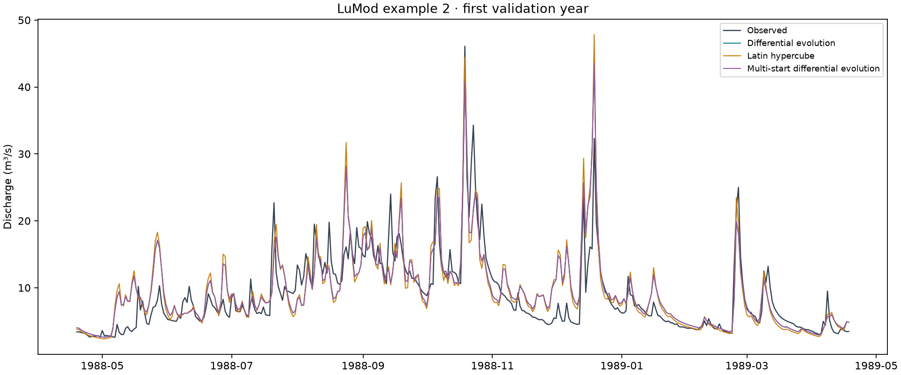
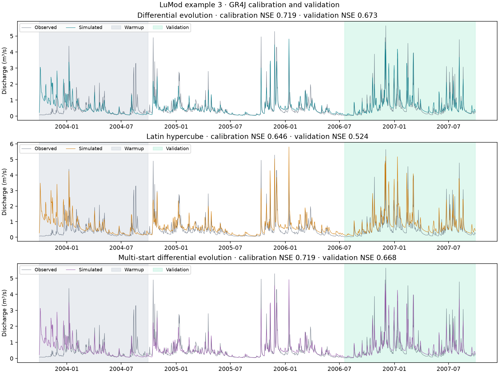
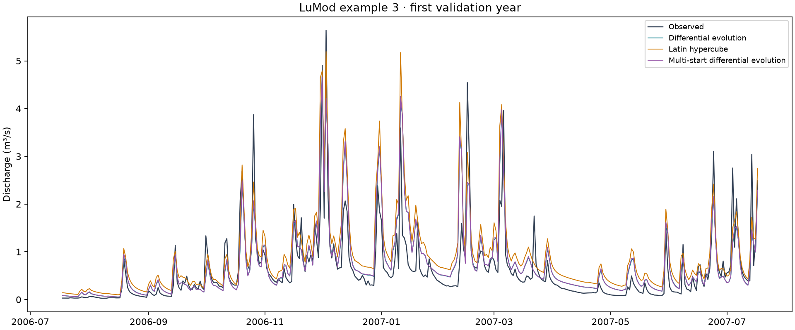
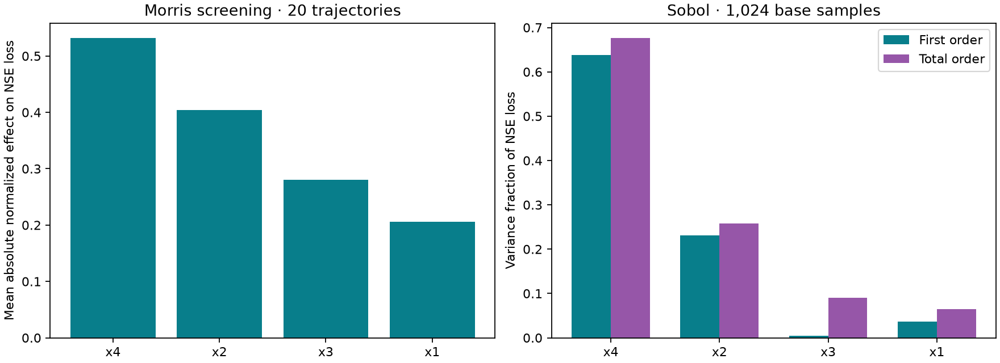

# Case study: LuMod example catchments

This case study fits GR4J to the three example datasets supplied with LuMod 0.1.3.0. It compares every calibration search supported by BasinForge: differential evolution, Latin-hypercube search, and multi-start differential evolution. All fits use the same forcings, parameter bounds, initial stores and NSE objective. Morris and Sobol sensitivity analyses are illustrated on example 2.

## Data and experiment

Precipitation, temperature and observed discharge come from `lumod.load_example(1)`, `(2)` and `(3)`. PET is computed using LuMod's GR4J PET routine and the supplied latitude. Observed discharge is converted from m³/s to mm per day using each catchment's area. Model output is converted back to m³/s for the hydrographs.

| Example | Area (km²) | Days | Calibration after warmup | Validation |
| --- | ---: | ---: | --- | --- |
| 1 | 382.0 | 10,957 | 1982-01-01 – 2001-12-30 | 2001-12-31 – 2010-12-31 |
| 2 | 73.4 | 3,287 | 1983-01-01 – 1988-04-18 | 1988-04-19 – 1990-12-31 |
| 3 | 30.0 | 1,460 | 2004-09-30 – 2006-07-17 | 2006-07-18 – 2007-09-29 |

The first 70% of each dataset is calibration, with the first 365 daily steps excluded from scoring as warmup. The last 30% is validation. Each simulation maintains continuous model history across the split. Validation never selects parameters or seeds.

Differential evolution uses seed 42, `maxiter=100`, `popsize=10`, and no polishing; it can stop before its maximum budget. Latin hypercube evaluates 3,000 candidates with seed 42. Multi-start repeats differential evolution with seeds 42, 43 and 44 and selects the smallest calibration loss. These budgets differ, so elapsed times are not equal-budget speed comparisons. The four calibrated parameters are `x1`, `x2`, `x3`, `x4`; initial store fractions retain the bundled defaults.

## Calibration and validation results

DE = differential evolution; LHS = Latin hypercube; multi-start = three DE seeds. RMSE is in mm per day; KGE uses the 2009 definition. All metrics, elapsed times and evaluation counts can be downloaded below.

| Example | Search | Calibration NSE | Validation NSE | Validation KGE | Validation RMSE |
| --- | --- | ---: | ---: | ---: | ---: |
| 1 | DE | 0.2413 | 0.1583 | 0.3948 | 2.4053 |
| 1 | LHS | 0.1583 | 0.0401 | 0.3617 | 2.5686 |
| 1 | Multi-start | 0.2413 | 0.1583 | 0.3948 | 2.4053 |
| 2 | DE | 0.7224 | 0.5910 | 0.7436 | 4.5635 |
| 2 | LHS | 0.6936 | 0.5343 | 0.7476 | 4.8695 |
| 2 | Multi-start | 0.7224 | 0.5910 | 0.7436 | 4.5635 |
| 3 | DE | 0.7188 | 0.6727 | 0.7815 | 1.2203 |
| 3 | LHS | 0.6465 | 0.5235 | 0.5364 | 1.4724 |
| 3 | Multi-start | 0.7191 | 0.6681 | 0.7754 | 1.2288 |

Example 1 has a weak fit under this configuration. For examples 1 and 2, multi-start selects the seed-42 result. For example 3, it selects seed 44 for its slightly better calibration loss, although its validation NSE is slightly lower. This illustrates why validation results should be assessed independently of optimizer selection. DE reports convergence for these fits; LHS exhausts its sampling budget and has no iterative convergence criterion.

## Hydrographs

The three panels in each full-period figure show each search separately against observed flow. Gray marks warmup and green marks validation. The enlarged plots overlay the three fits during the first validation year.

### Example 1





### Example 2





### Example 3





## Sensitivity: example 2

Morris uses 20 trajectories (100 evaluations); Sobol uses 1,024 base samples (6,144 evaluations) and 200 bootstrap replicates. Both score the calibration NSE loss after warmup, over the same independent uniform parameter ranges. These analyses explore the supported bounds, rather than a posterior distribution around the fitted parameters. Finite-sample Sobol estimates can be negative. The JSON downloads include the indices, bounds and estimator details.



## Downloads and reproduction

Download {download}`all nine fits' metrics <case-study-results/metrics.csv>`, {download}`calibrated parameters <case-study-results/parameters.csv>`, {download}`experiment settings <case-study-results/provenance.json>`, {download}`Morris results <case-study-results/sensitivity-morris.json>`, and {download}`Sobol results <case-study-results/sensitivity-sobol.json>`.

Each method also has an HTML report with a hydrograph and flow-duration curve, fit metadata and a simulation CSV:

| Example | DE report | LHS report | Multi-start report |
| --- | --- | --- | --- |
| 1 | <a href="case-study-results/example-1/de/report/index.html">Report</a> | <a href="case-study-results/example-1/lhs/report/index.html">Report</a> | <a href="case-study-results/example-1/multistart/report/index.html">Report</a> |
| 2 | <a href="case-study-results/example-2/de/report/index.html">Report</a> | <a href="case-study-results/example-2/lhs/report/index.html">Report</a> | <a href="case-study-results/example-2/multistart/report/index.html">Report</a> |
| 3 | <a href="case-study-results/example-3/de/report/index.html">Report</a> | <a href="case-study-results/example-3/lhs/report/index.html">Report</a> | <a href="case-study-results/example-3/multistart/report/index.html">Report</a> |

From a checkout, install `pip install -e '.[reference]'`, then run:

```bash
python examples/lumod_case_study.py --output results/lumod-case-study
```

The output directory must be new. The example generates all fits, multi-start trials, metrics, parameters, reports, figures, sensitivity indices and file checksums. The input data stay with the LuMod distribution. Timing depends on hardware and compilation cache; calibration results are specific to the documented model variant, PET, bounds and split.
