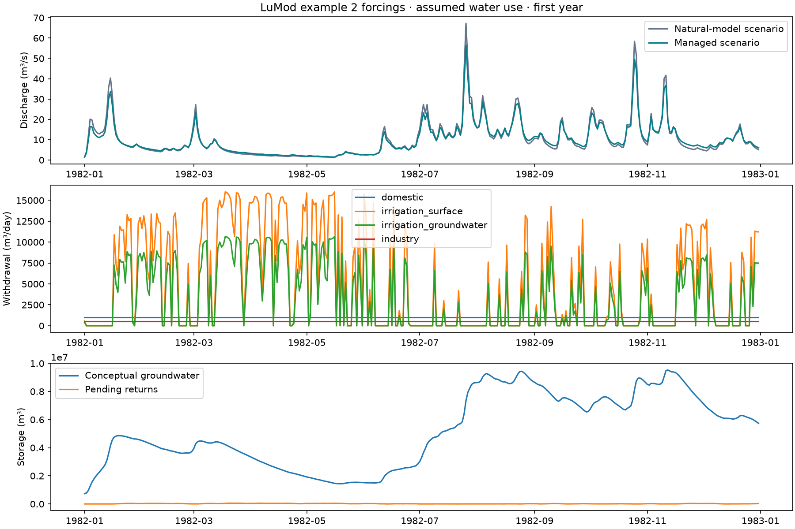

# Water withdrawals and allocation

The native daily managed-water layer represents surface-water diversions,
groundwater pumping, sector demands, consumption, delayed returns, a conceptual
aquifer and an optional reservoir. It works with daily hydrological models,
single-basin and multi-basin calibration, Morris/Sobol sensitivity and reports.
No CWatM, Pywr, PCRaster or MODFLOW installation is required.

Available since version 0.2.0. Install with
`python -m pip install basinforge-hydro==0.2.0`.

## Units and inputs

All managed-water flows are **m³ per daily step**, not m³/s. Storage and
capacities are m³. Multiply discharge in m³/s by 86,400. Convert model runoff
in mm/day to volume using `q_mm * basin.area_km2 * 1000`.
Dates must be contiguous, timezone-naive daily dates. Inputs are nonnegative
scalars or arrays with one value per day. Invalid/missing forcings are refused.

Measured withdrawals are preferable. Where they are unavailable, supply
explicitly labelled demand scenarios. Rainfall and outlet discharge do not
uniquely identify pumping, irrigation, consumption and return-flow parameters.

## Run accounting directly

```python
import pandas as pd
from basinforge import WaterDemand, WaterUseConfig, simulate_water_use

dates = pd.date_range("2020-01-01", periods=365)
demands = [
    WaterDemand("domestic", 3000, priority=0, consumption_fraction=0.2),
    WaterDemand("irrigation", 10000, priority=1, consumption_fraction=0.7,
                groundwater_return_fraction=0.5, return_delay_days=7),
    WaterDemand("industry", 2000, source="surface", priority=2,
                consumption_fraction=0.25, return_delay_days=2),
]
config = WaterUseConfig(
    environmental_flow=1000, pumping_capacity=5000,
    baseflow_fraction=0.2, groundwater_recession=0.03,
    groundwater_initial=100000,
)
# Constant natural inflow below is an illustrative scenario, not observations.
result = simulate_water_use(dates, 20000, demands, config)
print(result.summary())
result.daily.to_csv("water-balance.csv")
print(result.sectors["irrigation"])
```

`source` can be `surface`, `groundwater` or `mixed`. Mixed users can draw from
both sources. `max_withdrawal` limits each user's gross daily supply regardless
of requested demand. `pumping_capacity` limits total pumping. Unmet demand is
reported, not supplied from an unlimited fictitious groundwater source.
Livestock, power generation and other users can be represented with additional
`WaterDemand` records and their own observed/estimated demand series.

## Allocation methods

| Method | Rule | Suitable use |
| --- | --- | --- |
| `priority` | Compiled loop; lower priority number first; surface preferred, groundwater fallback for mixed users | Repeated calibration and scenario runs |
| `lp` | SciPy/HiGHS linear programming; maximise total supply within each priority group, then minimise pumping while preserving that supply | Competing source restrictions |

Priority-mode ties follow input order. LP ties do **not** guarantee equal
percentage satisfaction. Neither method optimises future reservoir operations
or represents water rights automatically. Both allocate one day at a time.

LP can improve source allocation: when a mixed user and a surface-only user
both request 10 m³ and each source has 10 m³ available, LP can serve both by
using groundwater for the mixed user. Greedy surface-first allocation may
leave the surface-only user short.

Environmental flow is reserved before surface diversion. When recession is
positive, pumping also retains enough aquifer water to meet today's remaining
environmental minimum through baseflow, if physically possible. Deficits are
reported if supply is insufficient; future ecological flows are not guaranteed.

## Equations and order of operations

Let $N_t$ be natural-model runoff volume, $U_t$ upstream inflow, $f$ the
partition fraction, $J_t$ separately supplied external recharge, $G_t$ aquifer
storage and $R^g_t,R^s_t$ returns due today. Natural runoff is partitioned:

```{math}
G_t^* = G_{t-1} + fN_t + J_t + R^g_t,
\qquad I_t^s=(1-f)N_t+U_t+R^s_t.
```

Aquifer storage exceeding `groundwater_capacity` spills to surface water.
Partitioning avoids counting $fN_t$ both as river inflow and new groundwater.
Do not supply recharge that duplicates the same water already in $N_t$.

The optional reservoir regulates this surface branch, before aquifer baseflow
joins downstream. With reservoir capacity $C_H$, starting storage $H$, requested
evaporation $E_t$ and maximum scheduled release $L_t$:

```{math}
\widetilde H_t=H_{t-1}+I_t^s,\qquad
E_t^a=\min(E_t,\widetilde H_t),
```

```{math}
Z_t=\max(0,\widetilde H_t-E_t^a-C_H),\qquad
H_t^*=\widetilde H_t-E_t^a-Z_t,
```

```{math}
L_t^a=\min(L_t,H_t^*),\qquad
H_t=H_t^*-L_t^a,\qquad S_t=Z_t+L_t^a.
```

Without a reservoir $S_t=I_t^s$. `reservoir_release` is an externally specified
maximum daily release, not a forecast-based operating policy. Its default is
unlimited, giving pass-through behaviour; specify a finite release schedule
to retain water. Evaporation is a requested volume capped by available storage.

For environmental minimum $F_t$ and recession fraction $k$, available sources
for abstraction are:

```{math}
A_t^s=\max(0,S_t-F_t),\qquad
G_t^{reserve}=\begin{cases}\max(0,F_t-S_t)/k,&k>0\\0,&k=0,\end{cases}
```

```{math}
A_t^g=\min\left(P_t^{max},\max(0,G_t^*-G_t^{reserve})\right).
```

For sector $i$, demand $D_{i,t}$, intake capacity $M_{i,t}$, supplied surface
volume $W^s_{i,t}$ and pumped volume $W^g_{i,t}$, allocation obeys:

```{math}
0\le W^s_{i,t}+W^g_{i,t}\le\min(D_{i,t},M_{i,t}),\quad
\sum_i W^s_{i,t}\le A_t^s,\quad
\sum_i W^g_{i,t}\le A_t^g.
```

Forbidden sources have zero withdrawal. LP solves these constraints separately
for each priority group using residual resources. For each group it first
maximises $\sum_i(W^s_{i,t}+W^g_{i,t})$, then minimises
$\sum_i W^g_{i,t}$ while fixing that maximum total supply.

Pumping occurs before aquifer recession:

```{math}
B_t=k\left(G_t^*-\sum_iW^g_{i,t}\right),\qquad
G_t^{after}=G_t^*-\sum_iW^g_{i,t}-B_t.
```

For consumption fraction $c_i$, groundwater share of returns $r_i$ and integer
delay $\ell_i$:

```{math}
W_{i,t}=W^s_{i,t}+W^g_{i,t},\quad
C_{i,t}=c_iW_{i,t},\quad
R_{i,t}^{generated}=(1-c_i)W_{i,t},\quad
D_{i,t}^{unmet}=D_{i,t}-W_{i,t}.
```

```{math}
R^g_{i,t+\ell_i}\mathrel{+}=r_iR_{i,t}^{generated},\qquad
R^s_{i,t+\ell_i}\mathrel{+}=(1-r_i)R_{i,t}^{generated}.
```

Delayed returns use explicit queues. Zero-delay returns are delivered **after**
allocation and cannot be withdrawn again within the same day. Surface returns
join the downstream outflow; groundwater returns enter aquifer storage, with
any capacity overflow spilling to the river. Delays above 36,500 days are
refused to bound queue memory.

Pending returns $T_t$ remain part of system storage even beyond the final day.
The checked daily managed-system balance is:

```{math}
\epsilon_t=(G+H+T)_{t-1}+N_t+U_t+J_t-Q_t-\sum_iC_{i,t}-E_t^a-(G+H+T)_t.
```

This checks the **managed-water subsystem**, not the complete rainfall/PET
balance inside every underlying hydrological kernel.

## Demand estimation

`domestic_demand(population, litres_per_person_day=100)` returns
$population\times rate/1000$ m³/day. Rates are user assumptions or supplied
measurements; the default is not universally applicable.

`irrigation_demand` provides a simple climatic estimate:

```{math}
D_t^{irr}=\frac{\max(0,K_{c,t}PET_t-aP_t)\,A_{irr}\,1000}{\eta}.
```

$A_{irr}$ is km², PET and precipitation are mm/day, $a$ is effective rainfall
fraction and $\eta$ application efficiency. Crop coefficients may vary daily,
including zero outside the growing season. This is **not** a soil-moisture,
paddy-water or crop-yield model. Irrigation water does not feed back into the
native model's soil store. Treat efficiency and consumption/return fractions
consistently; do not automatically classify all irrigation losses as consumed.

## One-call calibration, sensitivity and reporting

```python
from basinforge import (Basin, CalibrationConfig, WaterDemand, WaterUseConfig,
                        WaterUseScenario, managed_model, run_experiment,
                        managed_accounting)

basin = Basin.from_csv("basin.csv", basin_id="A", area_km2=1200,
                       q_unit="m3/s", timestep="daily")
scenario = WaterUseScenario(
    basin.dates,
    (WaterDemand("domestic", 3000, consumption_fraction=0.2),),
    WaterUseConfig(baseflow_fraction=0.2, groundwater_recession=0.03,
                   groundwater_initial=100000, pumping_capacity=5000),
)
model = managed_model("GR4J", scenarios={"A": scenario})
study = run_experiment(
    basin, model,
    CalibrationConfig(warmup=365, calibration_fraction=0.7,
                      bounds={"x1": (100, 1500), "wu_demand_scale": (0.5, 2)}),
    sensitivity="morris", output="managed-study",
)
accounting = managed_accounting(basin, model, study["fit"].parameters)
```

The existing DE, LHS and multi-start searches work unchanged. Use
`sensitivity="sobol"` for Sobol indices. Water parameters are:

| Parameter | Meaning | Supported range |
| --- | --- | --- |
| `wu_demand_scale` | Multiplier on all requested sector demands | 0–3 |
| `wu_consumption_scale` | Multiplier on specified consumption fractions | 0–1 |
| `wu_baseflow_fraction` | Natural runoff diverted into the conceptual aquifer | 0–1 |
| `wu_groundwater_recession` | Fraction of post-pumping aquifer water released daily | 0–1 |

Select explicit bounds/fixed parameters; the full default joint fit is often
unidentifiable. Consumption scaling only reduces the specified fractions;
change the scenario itself to explore higher fractions. Return delays and
sector-specific fractions are scenario settings, not continuous fit parameters.
Sensitivity scores use training discharge only, not a water-use observation
objective. The numerical water accounting does not validate assumed demands.

Managed one-call outputs additionally include `water-balance.csv`,
`water-sectors.csv` and `water-summary.json`. Preserve the scenario inputs with
your study: the fit contains their fingerprint but not all original series.
For manual report export pass `export_report(basin, fit, folder, model=model)`;
the wrapped model cannot be reconstructed from its name alone.

For independent/shared multi-basin fits, supply a mapping containing a scenario
for each basin ID and pass the wrapped model to `calibrate_many` or
`calibrate_shared`. Process workers are supported. Shared-model defaults for
partition/recession must agree; demand and other settings may differ by basin.
Training records must be scenario-aligned prefixes so stores/returns start from
the same initial state. Full validation simulations run continuously.

## Connected basins

`run_water_network(dates, natural_runoff, scenarios, downstream,
travel_days=...)` processes basins upstream to downstream. Each basin has one
downstream destination or `None`. Cycles and unknown IDs are refused.
Provide **local/incremental** runoff volumes: full-catchment upstream runoff
would double-count water. Integer travel delays retain unarrived outflows as
`final_transit`; a network-wide balance includes that storage. Bifurcations,
canal transfers and a network-wide optimisation are not represented.

## LuMod forcing case study

From a checkout with the optional example-data dependency:

```bash
python -m pip install -e '.[reference]'
python examples/water_withdrawals.py --output water-use-study
```

This uses LuMod example 2 forcings and discharge with **assumed**, clearly
labelled domestic/industrial/irrigation scenarios. It runs DE, LHS and
multi-start calibration; generates Morris sensitivity, hydrographs and
accounting exports; runs Morris/Sobol sensitivity for the water parameters;
compares priority and LP; and checks a two-basin network.
It is not a reconstruction of measured withdrawals at the LuMod catchment.

### Executed example

The executed scenario assumes 10,000 residents, irrigation on 5% of basin
area with 60% of irrigation demand assigned to surface water and 40% to
groundwater, and 500 m³/day industrial demand. Initial aquifer storage is
10 mm of catchment-equivalent water. The record contains 3,287 daily steps.
Hydrological parameters were fitted; the withdrawal assumptions were fixed.

| Search | Training NSE | Validation NSE | Validation KGE |
| --- | ---: | ---: | ---: |
| DE | 0.7050 | 0.6172 | 0.7421 |
| LHS | 0.6296 | 0.5590 | 0.7448 |
| Multi-start DE | 0.7149 | 0.6034 | 0.7184 |

These are limited-budget demonstrations: DE uses 10 iterations and population
multiplier 5; LHS uses 100 samples; multi-start uses seeds 42 and 43. Warmup is
365 days and the chronological training fraction is 70%. Results do not
establish that this managed representation improves on an unmanaged model.



View fitted hydrographs: [DE](water-use-results/de-hydrograph.png),
[LHS](water-use-results/lhs-hydrograph.png),
[multi-start](water-use-results/multistart-hydrograph.png).
Download [scenario assumptions and results](water-use-results/scenario.json)
and [water-parameter Morris/Sobol results](water-use-results/water-sensitivity.json).

The maximum daily managed-water balance error was $1.86\times10^{-9}$ m³.
One local warmed run of priority accounting processed 3,287 days in about
0.8 ms; LP processed the first 365 days in about 0.66 s. These timings include
the accounting API and table creation, but exclude hydrological simulation,
calibration and initial compilation. They are not cross-machine benchmarks
or a same-duration comparison. The network's total balance residual was about
$-1.42\times10^{-7}$ m³, including end-of-record transit storage.

## Scientific scope and sources

The aquifer is a lumped linear store, not native HBV groundwater storage or a
spatial aquifer solution. Partitioning already-routed model runoff into a new
store changes timing; partition/recession require independent justification.
Well distance, aquifer transmissivity, drawdown, streambed resistance and
spatial pumping impacts require a groundwater model such as MODFLOW or
appropriate analytical depletion solutions.

The implementation is original BasinForge code. Scientific design references:

- [CWatM water demand](https://cwatm.iiasa.ac.at/_modules/cwatm/hydrological_modules/water_demand/water_demand.html): sector demands, consumption and returns.
- [PCR-GLOBWB 2](https://gmd.copernicus.org/articles/11/2429/2018/index.html): integrated withdrawals and water availability.
- [WaterGAP 2.2d](https://gmd.copernicus.org/articles/14/1037/2021/gmd-14-1037-2021.html): separate surface/groundwater abstractions and returns.
- [Pywr](https://github.com/pywr/pywr): network allocation using linear programming.
- [USGS streamflow depletion](https://www.usgs.gov/publications/streamflow-depletion-wells-understanding-and-managing-effects-groundwater-pumping): limits of simplified pumping representations.

Tests cover hand-calculated cases, both allocators, randomized daily mass
balances, depletion/returns, reservoir evaporation/releases, network transit,
parallel/shared fitting and scenario-sensitive fingerprints. These establish
numerical contracts, not predictive validity for a particular basin.
